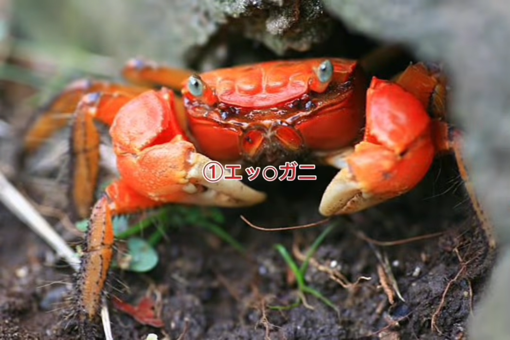

# Crab Champions 繁體中文翻譯補包

把 Steam 上的 Crab Champions 變成繁體中文。一個檔案搞定，免設定、可隨時解除。

## 📥 安裝

1. 到 [Releases 頁面](../../releases) 下載 `CrabChampions-WindowsNoEditor_P.pak`
2. 找到你的遊戲安裝目錄（Steam → 右鍵 Crab Champions → 管理 → 瀏覽本機檔案）
3. 進到 `CrabChampions\Content\Paks\`
4. 在裡面新增一個資料夾叫 `~mods`（開頭的 `~` 很重要）
5. 把下載的 `.pak` 檔丟進 `~mods\`
6. 啟動遊戲，享受繁中介面

最終路徑應該長這樣：
```
...\Crab Champions\CrabChampions\Content\Paks\~mods\CrabChampions-WindowsNoEditor_P.pak
```

## 🗑️ 解除安裝

刪掉 `~mods\` 裡的 `.pak` 檔即可，遊戲下次啟動完全恢復英文版。

## ⚠️ 注意事項

- **免啟動參數**：放進去就好，不需要額外設定
- **多人連線安全**：只改文字，不動任何遊戲數值
- **部分字串維持英文**：設定選項的值（如 Windowed / Low / High / On / Off）和少數系統字寫死在遊戲程式裡，補包無法覆蓋。這是引擎限制，不是 bug
- 如果你的 Windows 系統語言不是中文或英文，可能需要在 Steam 啟動選項加上 `-culture=zh-Hant`

## 🐛 回報問題

翻譯有誤或發現沒翻到的字串？歡迎開 [Issue](../../issues) 回報。
